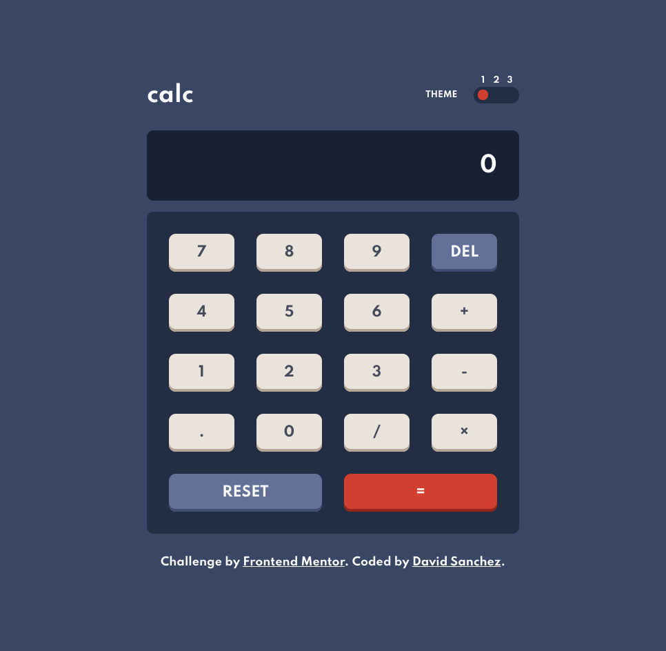

# Frontend Mentor - Calculator app solution

This is a solution to the [Calculator app challenge on Frontend Mentor](https://www.frontendmentor.io/challenges/calculator-app-9lteq5N29). Frontend Mentor challenges help you improve your coding skills by building realistic projects.

## Table of contents

- [Frontend Mentor - Calculator app solution](#frontend-mentor---calculator-app-solution)
  - [Table of contents](#table-of-contents)
  - [Overview](#overview)
    - [The challenge](#the-challenge)
    - [Screenshot](#screenshot)
    - [Links](#links)
  - [My process](#my-process)
    - [Built with](#built-with)
    - [What I learned](#what-i-learned)
    - [Continued development](#continued-development)
  - [Author](#author)

**Note: Delete this note and update the table of contents based on what sections you keep.**

## Overview

### The challenge

Users should be able to:

- See the size of the elements adjust based on their device's screen size
- Perform mathmatical operations like addition, subtraction, multiplication, and division
- Adjust the color theme based on their preference
- **Bonus**: Have their initial theme preference checked using `prefers-color-scheme` and have any additional changes saved in the browser

### Screenshot



### Links

- Solution URL: [GitHub Repo](https://github.com/d4vsanchez/calculator-vanilla-js)
- Live Site URL: [GitHub Pages](https://d4vsanchez.github.io/calculator-vanilla-js/)

## My process

### Built with

- Semantic HTML5 markup
- CSS custom properties
- Flexbox
- CSS Grid
- Mobile-first workflow
- Vanilla JS

### What I learned

It was pretty cool to build the JS using best practices from software engineering.

The first thing I did was to decouple the Calculator engine logic. This way, the CalculatorView is not tied to a single way of doing calculations. If someone wants to change how the engine works, without changing how the view behaves, that is totally possible.

```javascript
new CalculatorView(new DifferentCalculatorEngine());
```

Another thing that was awesome to learn was how to animate the theme tip indicator when you changed the theme. I didn't want to make the tip change theme in a static way but to move in the track following an inertia like-behavior.

I ended up doing: 1 div for the track, 3 radio buttons for the 3 themes and 1 span as the tip.

```html
<form class="theme-toggle">
  <span class="selected-theme"></span>

  <!-- Radio buttons here -->
</form>
```

And moving the `selected-theme` span based on which radio button was selected at the moment.

### Continued development

I thought this should be made using Vanilla JS, but it seems it's not. I'd like to implement this using a JS library I'm not familiar with like:

- New versions of VueJS
- Svelte
- Lit

I'm also a bit uncomfortable on how I implemented the themes. I'd like to add some lazy loading to them, so I might find better ways to handle that.

## Author

- Website - [David Sánchez](https://davsanchez.com)
- Frontend Mentor - [@d4vsanchez](https://www.frontendmentor.io/profile/d4vsanchez)
- Twitter - [@d4vsanchez](https://www.twitter.com/d4vsanchez)
